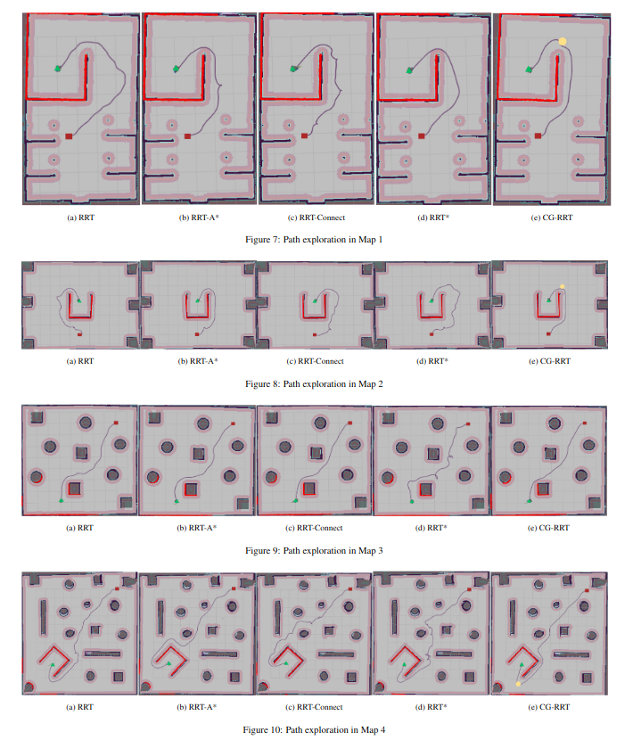
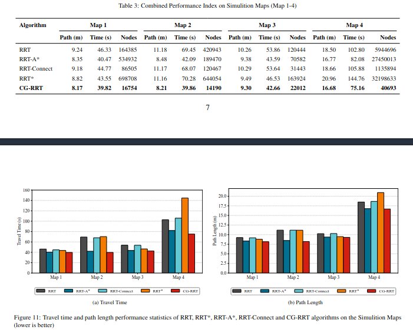
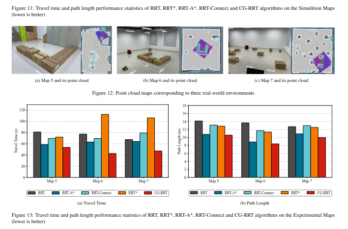

# ROS2 Path Planning

This repository provides a ROS2-based path planning implementation, adapted from the [AI_winter ros_motion_planning] project.

The algorithm implemented in this repository is ConfidenceGoal-RRT, optimized from the AI Winter framework to address local minima issues in terrain navigation. The comparison results with other RRT-based algorithms are presented in the image below.

 
 
 

## Installation

1. Clone the source code into your workspace:
## Installation
Follow ([https://github.com/AIWinter/ros_motion_planning](https://github.com/ai-winter/ros_motion_planning.git))

1. Clone the AI-winter source code into your workspace

2. Build the package using Colcon

## Configuration

The `param_saver` tool is used to load the planner configuration and parameter files located in `/turtlebot3_ws/src/turtlebot3/turtlebot3_navigation2`.

## Testing

After loading the planner plugin, you can test the code using the TurtleBot3 Burger model.

- **Terminal 1**: Launch the Gazebo simulation environment:
ros2 launch turtlebot3_gazebo turtlebot3_world.launch.py

- **Terminal 2**: Launch the navigation stack:
ros2 launch turtlebot3_navigation2 navigation2.launch.py use_sim_time:=True map:=$HOME/map.yaml

